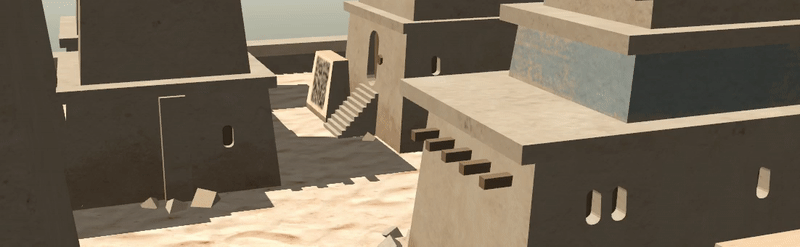
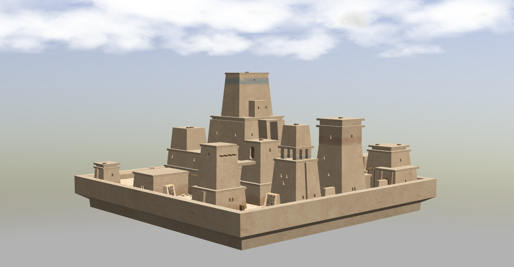

<!-- Written by Nikolay Dema <ndema2301@gmail.com>, September 2022 -->

### Хакатон СтарЛайн 2022

Репозиторий содержит ПО, необходимое для участия в Хакатоне, проводимом
НПО СтарЛайн в 2022 году.

### Работа с симулятором



Симуляция включает модель небольшого, затерянного в песках города и робота,
имеющего на борту rgbd-камеру и лидар.

В качестве симулятора используется [gazebo](https://classic.gazebosim.org/).
В качестве основного фреймворка для разработки используется
[ROS2](https://docs.ros.org/en/galactic/).

Работа с симулятором предполагается внутри docker-контейнера, скрипты и
утилиты для работы с которым предоставляются в составе репозитория.

#### Установка требуемого ПО

1. Склонируйте репозиторий и перейдите в корневую директорию репозитория.

        git clone https://gitlab.com/starline/hackathon_2022
        cd hackathon_2022

2. Установите docker:

    Для установки можно воспользоваться скриптом ниже. В случае, если на вашем
    ПК используется видеокарта от nvidia, то обозначенный скрипт следует
    исполнить с параметром **-n** или **--nvidia**. В этом случае на хост
    дополнительно будет установлен NVIDIA Container Toolkit

        bash scripts/docker_install.bash

    **Для установки вручную** воспользуйтесь
    [официальной инструкцией установки docker](https://docs.docker.com/install/linux/docker-ce/ubuntu/).
    В случае, если на вашем ПК используется видеокарта от nvidia, то дополнительно
    следует установить [nvidia container toolkit](https://github.com/NVIDIA/nvidia-docker).

    После этой операции следует перезайти в систему для корректной работы docker.


#### Использование docker-контейнера и организация процесса разработки

1. Для работы с докер-контейнером доступны следующие скрипты:

        simulation/docker/run.bash  - запуск контейнера
        simulation/docker/into.bash - запуск bash-сессии в контейнере
        simulation/docker/stop.bash - остановка контейнера

    Соответственно, для запуска контейнера запустите скрипт:

        bash simulation/docker/run.bash

    _При первом запуске образ для контейнера скачается автоматически._

    Для выхода из bash-сессии используйте сочетание клавиш ```Ctrl + D```.

2. Рабочее окружение colcon расположено в ```simulation/workspace``` и монтируется
внутрь контейнера в корень файловой системы, таким образом разработку можно
вести как внутри, так и вне контейнера.

    Для сборки пакетов откройте новую bash-сессию в контейнере, перейдите в
    директорию окружения и выполните соответствующую команду:

        bash simulation/docker/into.bash
        cd /workspace
        colcon build --symlink-install

    **После первой сборки окружения требуется переоткрыть bash-сессию в контейнере,
    чтобы собранные пакеты стали видимы в системе.**


#### Описание предоставляемого ПО

Для запуска симуляции воспользуйтесь launch-файлом из пакета survey:

    ros2 launch survey ozyland.launch.py

После этого в окне gazebo вы должны увидеть примерно следующую картинку:



### Работа с Turtlebot 2

Конфигурация мобильного робота turtlebot v2 включает:

* Колесную базу с дифферециальным типом привода kobuki

* RGBD-камера ​Astra Orbbec Pro

* Лидар ​RPLidar A2​

* Бортовой ПК ​Intel NUC [BOXNUC7I7BNH]

* Для питания бортового ПК и всей дополнительной сенсорики используется дополнительный аккумулятор Rombica NEO PRO 280

    

#### Установка требуемого ПО

1. Если вы получили робота во время участия в хакатоне, то смело переходите к следующему разделу, все требуемое ПО уже должно быть установлено на роботе.

2. Склонируйте репозиторий и перейдите в корневую директорию репозитория.

3. Установите docker, задайте необходимое для работы окружение и udev-правила для используемого на turtlebot аппаратного обеспечения вызвав следующие команды:

        bash scripts/docker_install.bash
        bash kobuki/scripts/kobuki_setup.bash

    После этих операций следует перезайти в систему для корректной работы docker.


#### Использование docker-контейнера и организация процесса разработки

1. Для работы с докер-контейнером доступны следующие команды.

        kobuki_docker_run  - запуск контейнера
        kobuki_docker_into - запуск bash в контейнере

    В случае, если по какой-то причине они не доступны, можно воспользоваться ими напрямую:

        bash kobuki/docker/run.bash - запуск контейнера
        bash kobuki/docker/into.bash - запуск bash в контейнере


2. Рабочее окружение colcon расположено в ```kobuki/workspace``` и монтируется
внутрь контейнера в корень файловой системы, таким образом разработку можно
вести как внутри, так и вне контейнера.

    *Если вы получили робота во время участия в хакатоне, то рабочее окружение уже должно быть собрано и можно перейти к следующему разделу.*

    Для сборки пакетов откройте новую bash-сессию в контейнере, перейдите в
    директорию окружения и выполните соответствующую команду:

        kobuki_docker_into
        cd /workspace
        colcon build --symlink-install

    **После первой сборки окружения требуется переоткрыть bash-сессию в контейнере,
    чтобы собранные пакеты стали видимы в системе.**

#### Работа с окружением, описание предоставляемого ПО

1. Для запуска драйверов следует использовать соответствующие launch файлы:

        ros2 launch kobuki_node kobuki.launch.py     - запуск драйвера kobuki
        ros2 launch rplidar_ros rplidar.launch.py    - запуск драйвера лидара
        ros2 launch astra_camera dabai_dw.launch.py  - запуск драйвера rgbd-камеры

    Запустите драйвер kobuki, затем откройте новый терминал, войдите в контейнер и запустите teleop:

        kobuki_docker_into
        ros2 run teleop_twist_keyboard teleop_twist_keyboard /cmd_vel:=/commands/velocity

     В случае, если вы можете управлять роботом, то подготовку к работе с Turtlebot 2 можно считать оконченой.
